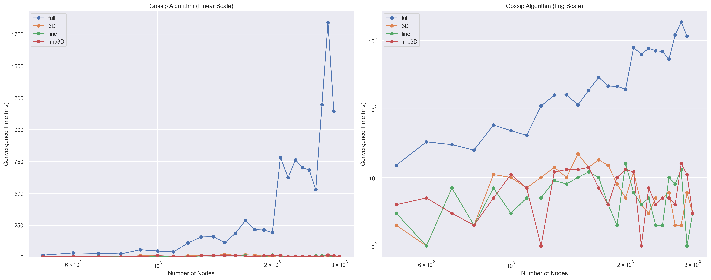
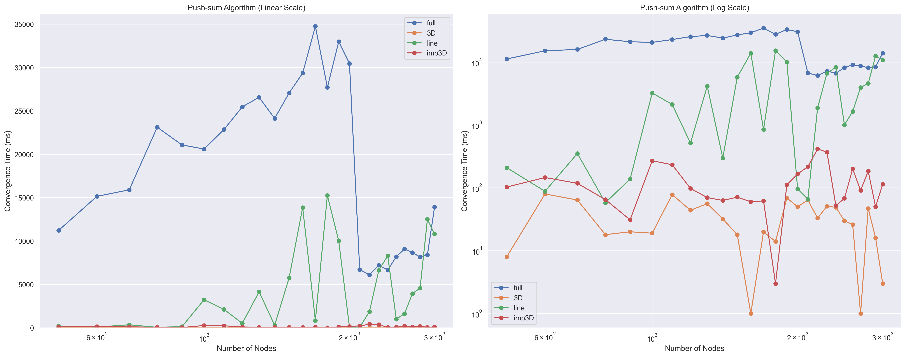

<div align="center">

# **Project 2: Report**

COP5615: Distributed Operating Systems Principles  
**Fall 2024**

<br><br><br>

**Nitin Goyal**  
Email: [nitin.goyal@ufl.edu](mailto:nitin.goyal@ufl.edu)  
Electrical and Computer Engineering  
University of Florida

<br>

**Oct 06, 2024**

</div>

# Gossip and Push-Sum Algorithms Simulation

This project simulates and compares the Gossip and Push-Sum algorithms across different network topologies and sizes.

## How to Run

1. Navigate to the project directory in your terminal.
2. Compile the Pony program:

   ```
   ponyc src
   ```

3. Run the simulation:

   ```
   ./src <num_nodes> <topology> <algorithm> <logging>
   ```

   Where:
   - `<num_nodes>` is the number of nodes in the network
   - `<topology>` can be "full", "3D", "line", or "imp3D"
   - `<algorithm>` can be "gossip" or "push-sum"
   - `<logging>` can be "on" to enable logging or "off" to disable it (default is "off")

4. To run multiple simulations and generate plots:

   ```
   python src/test.py
   python src/plot_results.py
   ```

## Project Architecture

The project is structured as follows:

- `src/`: Contains the main Pony source files
  - `gossip_member.pony`: Implementation of the Gossip algorithm
  - `push_sum_member.pony`: Implementation of the Push-Sum algorithm
- `src/test.py`: Python script to run multiple simulations
- `src/plot_results.py`: Python script to generate plots from results
- `results.csv`: CSV file containing simulation results
- `logs/`: Directory containing detailed logs for each simulation run (when logging is enabled)

The Pony program implements a network of actors, each representing a node in the network. The network topology, algorithm, and logging options are determined by command-line arguments. The Python scripts automate the process of running multiple simulations and visualizing the results.

## Results and Observations

### Convergence Behavior

One notable observation is that even after convergence, the application remains active for a period before exiting. This duration increases with larger networks, despite no additional message passing between actors.

Hypothesis: Larger networks with more connections require more post-processing cleanup, potentially due to Pony's actor system management.

### Largest Network Times

Gossip Algorithm:
- Imperfect 3D and 3D: 200,000 nodes ≈ 9 seconds
- Full: 5,000 nodes ≈ 4 seconds
- Line: 150,000 nodes ≈ 4 seconds

Push-Sum Algorithm:
- 3D: 150,000 nodes ≈ 4 seconds
- Imperfect 3D: 15,000 nodes ≈ 26 seconds
- Line: 20,000 nodes ≈ 20 seconds
- Full: 5,000 nodes ≈ 9 seconds

## Visual Results

### Gossip Algorithm Performance



### Push-Sum Algorithm Performance



## Analysis

1. **Topology Efficiency:**
   - 3D and Imperfect 3D topologies converge faster than Full or Line.
   - Convergence time for 3D and Imperfect 3D remains relatively constant as network size increases.
   - Full and Line topologies show increasing convergence times with larger networks.

2. **Scalability:**
   - Full topology exhibits near-linear increase in convergence time initially, transitioning to exponential growth with larger networks.

3. **Algorithm Comparison:**
   - Gossip algorithm generally shows better scalability across topologies.
   - Push-Sum algorithm performance varies more significantly between topologies.

## Conclusion

The choice of network topology significantly impacts the convergence time of both Gossip and Push-Sum algorithms. 3D and Imperfect 3D topologies demonstrate superior scalability, especially for larger networks. The Full topology, while efficient for smaller networks, becomes less practical as network size increases due to its exponential growth in convergence time.

These findings underscore the importance of topology selection in distributed system design, particularly for large-scale applications where efficient information dissemination is crucial.
